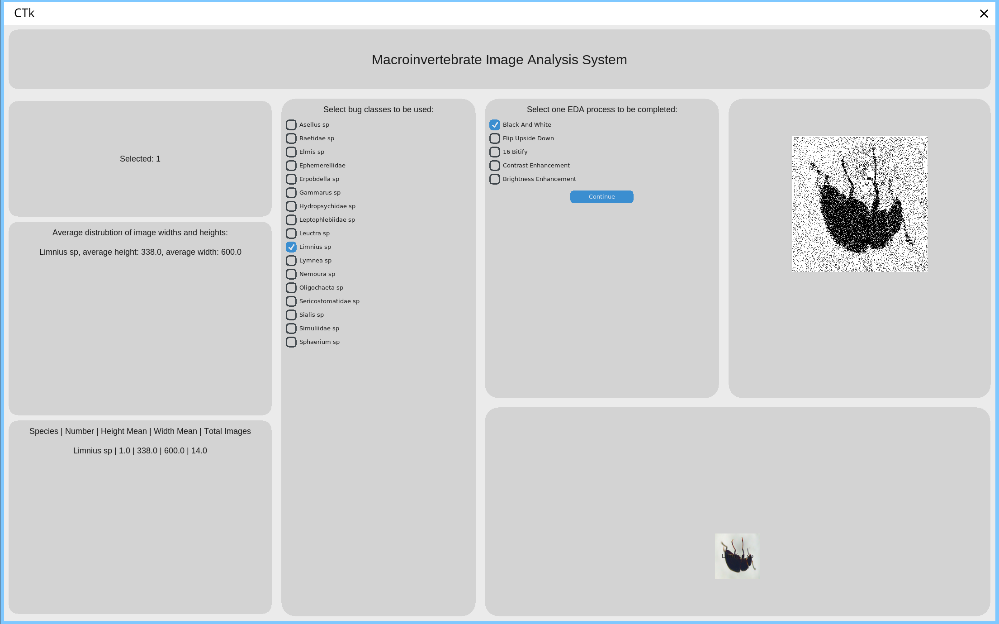
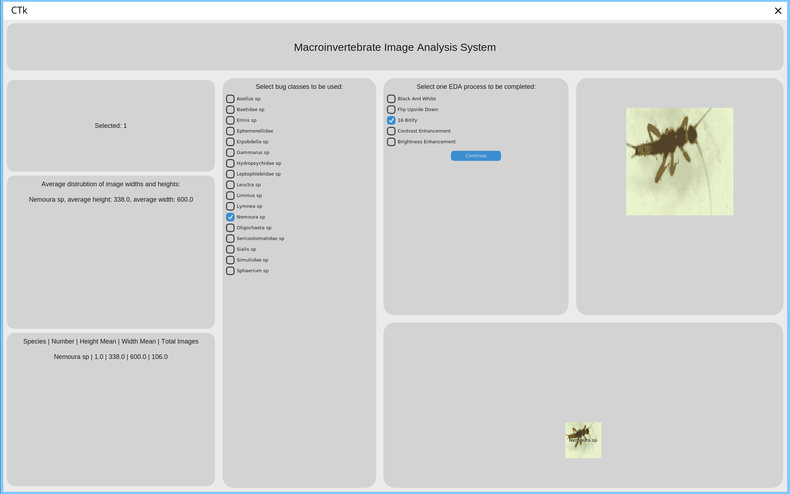
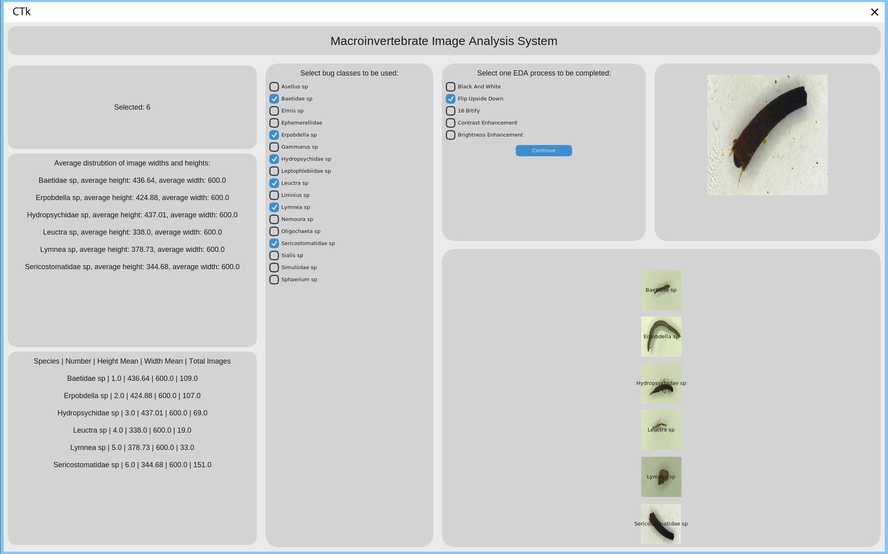

# MacroInvertebrate Image Analysis System

## Members
Reed
Dylan

## Goal
To make a GUI interface to show some details and do some image processing and handling for different insect species.

## Summary of system design
We used a few classes to handle image processing, file handling and exploratory data analysis. We also imported some external libraries such as pandas, the Pillow Imaging Library (PIL) and Tkinter to name a few. These helped with the image processing, in the case of PIL, the exploratory data analysis with pandas and Tkinter helped with the GUI.

## Class and Module Overview
The FileHandling class helped to ensure the processed images got saved somewhere for the user to look at later. The ImageManipulation class helped to handle the processing of the randomly chosen image based off what was representative in one of the species chosen, to for example make it black and white. The edaData class helped to be able to get the edaData used in the GUI to showcase the details about each species chosen and some representative images.

## Tools and libraries used
Throughout this project, we used the following libraries:
os, math, time, random, sys, pandas, customtkinter (ctk) and PIL.
Out of these, the ones that helped get the actual image processing stuff done the most was os, to be able to OS agnosticly be able to get the path to the images we need to process, CTK to be able to do the GUI for the user to use, and for pandas to help store the dataframe table for some of the EDA data.

## Key features implemented
The key features we implemented were getting the mean width and height of each species, getting a set of representative images based off that and if they were within 1 standard deviation of the means, and the summary table to showcase a lot of this data. We also implemented handling the images to be able to turn the image black and white, make it brighter, turn up the contrast, amongst others.

## Images of example outputs

## Testing summary
Testing for the edaData class was done via the main() function in that modules file, done to test every action in the class.
Testing for the file handling and image processing libraries were primarily done via the GUI and debugging issues involved temporarily using print statements to work out where things weren't working.

## Reused code
None
